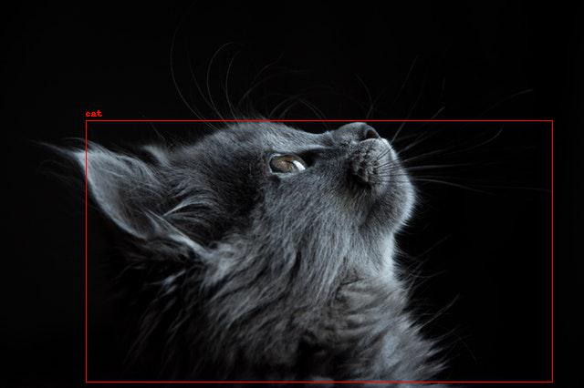

# Inference Computer

## Setup

1. Create a python virtual environment and activate.

```sh
virtualenv venv;
source venv/bin/activate
```

2. Install dependencies:

```sh
python -m pip install tensorflow numpy opencv-python cython image requests
```

3. Clone darkflow repo:

```sh
git clone https://github.com/thtrieu/darkflow.git
```

4. Install darkflow:

```sh
cd darkflow;
pip install .;
cd ..
```

5. [Download](https://drive.google.com/drive/folders/0B1tW_VtY7onidEwyQ2FtQVplWEU) some pre-trained yolo weights as specified in the darkflow repo readme. I chose to download yolo.weights. Put the downloaded weights in the `weights` directory. Depending on the .weights file chosen you may need to update the model config being used in the model_options dictionary in config.py.

6. Copy the configs from the darkflow repo:

```sh
cp -r darkflow/cfg .
```

7. Update any necessary values in the config.py file for your case.

8. Run the app:

```sh
python3 app.py
```

## Configuration

See the config.py file to see program options.

## Example Usage

After carefully following the setup steps see the `predict-local-images.py` and `predict-camera-server-images.py` files for two examples. You should be able to run the local images file right out of the box after setup:

```sh
python3 predict-local-images.py
```

If you didn't alter the `config.py` file take a look at the `detected-images` and `labeled-images` directories to see the script output images. Here is an example output image:



### Using With the Camera Server

After going through the [setup](../camera-server/README.md) run the camera in a new terminal:

```sh
# From ../camera-server/
python3 app.py
```

Run the `predict-camera-server-images.py` script:

```sh
python3 predict-camera-server-images.py
```

Every few seconds the script should get an image from the camera server then predict on it. The images will be stored in a similar way as described in the paragraph above.