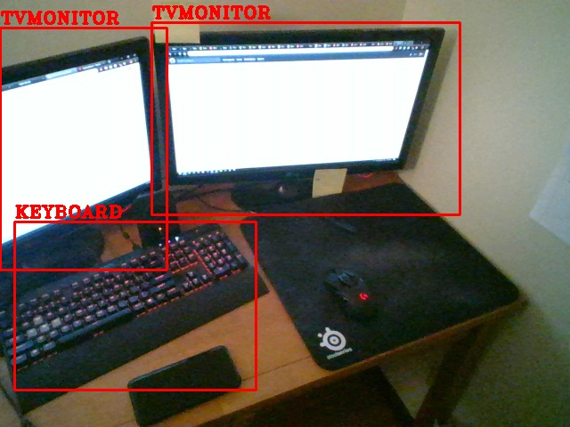
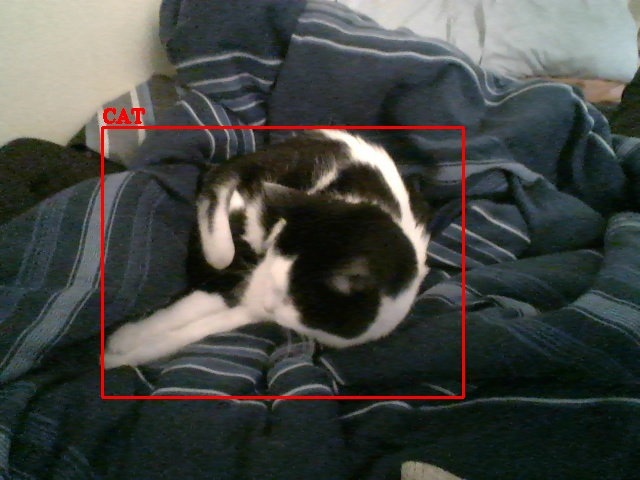

# Inference

## Setup

1. Clone the darkflow repo:

```sh
git clone https://github.com/thtrieu/darkflow.git
```

2. Initialize the environment:

```sh
make init-env
```

3. [Download](https://drive.google.com/drive/folders/0B1tW_VtY7onidEwyQ2FtQVplWEU) some pre-trained yolo weights as specified in the darkflow repo readme. I chose to download yolo.weights. Put the downloaded weights in the `inference/weights` directory. Depending on the .weights file chosen you may need to update the model config being used in the model_options dictionary in config.py.

4. Update any necessary values in the `inference/config.py` file for your case.

## Configuration

See the config.py file to see program options.

## Example Usage

After carefully following the setup steps see the `example.py` file for an example. You should be able to run the example script in the inference directory right out of the box after setup:

```sh
python3 example.py
```

If you didn't alter the `config.py` file take a look at the `images/detected-images` and `images/labeled-images` directories to see the script output images. Here is an example output image:


### Using With the Camera Server

You can also run the camera server on the same computer to test out predicting from images supplied by the camera server. After going through the [setup](../camera-server/README.md) run the camera in a new terminal:

```sh
# From <root>/camera-server/
sh run.sh
```

Run the `example.py` script with selected parameter:

```sh
python3 example.py -c
```

Every few seconds the script should get an image from the camera server then predict on it. The images will be stored in a similar way as described in the paragraph above.

Example output images:



